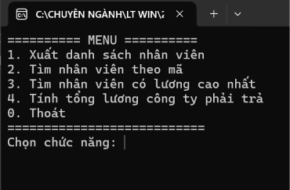
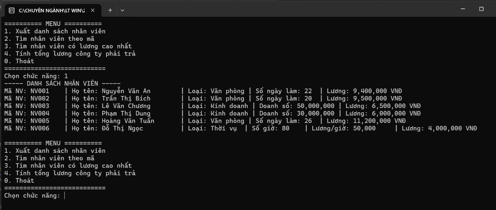
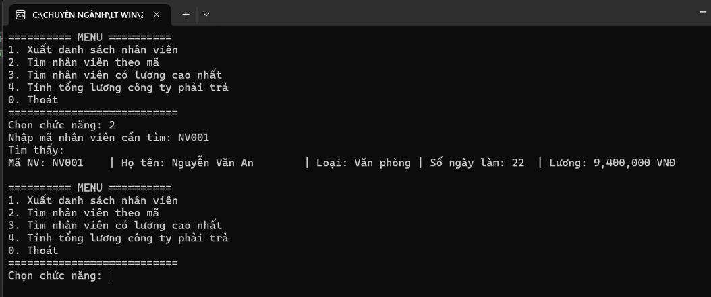
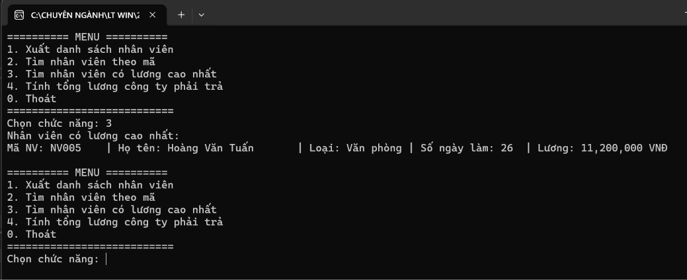
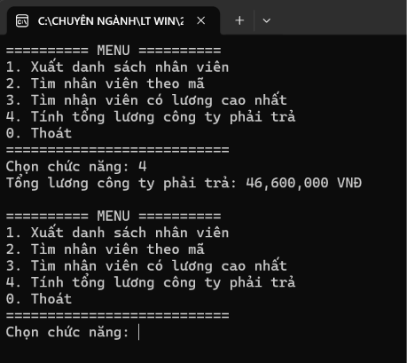

# Quản lý Nhân viên bằng Console (C# OOP - Đa hình)

## Thông tin sinh viên
- Họ tên: Huỳnh Thị Hồng Ân
- MSSV: 49.01.103.006
- Lớp: 49.01.SPTIN.A

## Mô tả
Chương trình Console C# quản lý danh sách nhân viên của công ty, minh họa tính **đa hình** trong lập trình hướng đối tượng. Mỗi loại nhân viên có cách tính lương khác nhau, nhưng chương trình xử lý (xuất danh sách, tìm lương cao nhất, tính tổng lương) hoàn toàn thông qua lớp cha `NhanVien` mà không cần biết cụ thể đó là loại nhân viên nào.

## Công nghệ sử dụng
- C# Console App
- .NET (Visual Studio)
- Lập trình hướng đối tượng: kế thừa, đa hình (`virtual`/`override`)
- LINQ (tìm kiếm theo mã)

## Yêu cầu class
- `NhanVien`: lớp cha, có `MaNV`, `HoTen`, `LuongCoBan`; constructor kiểm tra lương cơ bản phải lớn hơn 0; có method ảo `TinhLuong()` và `HienThiThongTin()` để các lớp con override.
- `NhanVienVanPhong`: kế thừa `NhanVien`, thêm `SoNgayLamViec` (0-31); lương = lương cơ bản + số ngày làm × đơn giá ngày (200.000 VNĐ/ngày).
- `NhanVienKinhDoanh`: kế thừa `NhanVien`, thêm `DoanhSo` (>= 0); lương = lương cơ bản + 5% doanh số.
- `NhanVienThoiVu`: kế thừa `NhanVien`, thêm `SoGioLam`, `LuongTheoGio` (đều >= 0); lương = số giờ làm × lương theo giờ (không dùng lương cơ bản để tính, nhưng vẫn phải truyền giá trị > 0 cho lớp cha).
- `Program`: chứa `Main`, menu, dữ liệu mẫu ban đầu và các hàm xử lý gọi qua đa hình.

## Chức năng
- Xuất danh sách nhân viên (hiển thị đúng thông tin riêng của từng loại nhờ đa hình)
- Tìm nhân viên theo mã (dùng LINQ)
- Tìm nhân viên có lương cao nhất (chỉ dựa vào `TinhLuong()`, không cần `if`/`switch` theo loại)
- Tính tổng lương công ty phải trả (chỉ dựa vào `TinhLuong()`)
- Thoát chương trình

Chương trình có sẵn dữ liệu mẫu gồm 6 nhân viên (2 văn phòng, 2 kinh doanh, 1 văn phòng thêm, 1 thời vụ) để chạy thử ngay khi khởi động.

## Cách chạy
1. Mở file `.sln`/`.csproj` bằng Visual Studio
2. Build solution
3. Chạy project (F5 hoặc Ctrl+F5)
4. Chọn chức năng theo menu hiển thị trên màn hình Console

## Xử lý dữ liệu nhập
- Nhập sai kiểu dữ liệu ở lựa chọn menu (ví dụ nhập chữ) không làm chương trình dừng bất thường; chương trình yêu cầu nhập lại số nguyên hợp lệ.
- Lương cơ bản phải lớn hơn 0, số ngày làm việc phải trong khoảng 0-31, doanh số và số giờ làm/lương theo giờ phải >= 0; nếu vi phạm, constructor sẽ ném lỗi khi khởi tạo nhân viên.
- Tìm theo mã không tồn tại sẽ được thông báo không tìm thấy thay vì gây lỗi chương trình.

## Hình ảnh màn hình

### Menu chương trình

### Xuất danh sách nhân viên

### Tìm nhân viên theo mã

### Tìm nhân viên có lương cao nhất

### Tính tổng lương công ty
