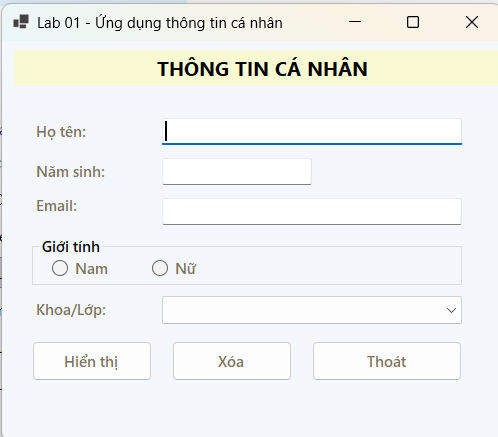
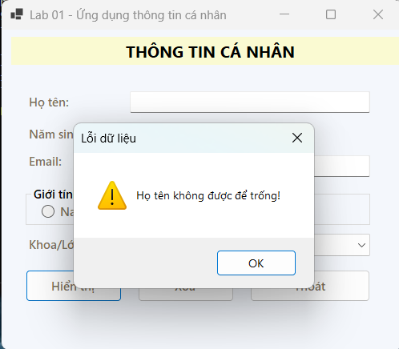
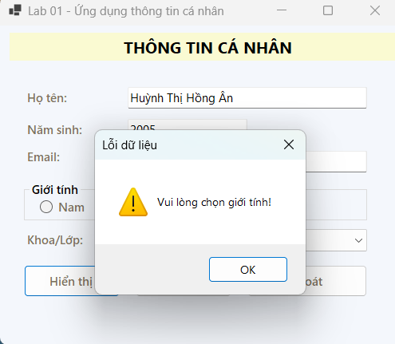
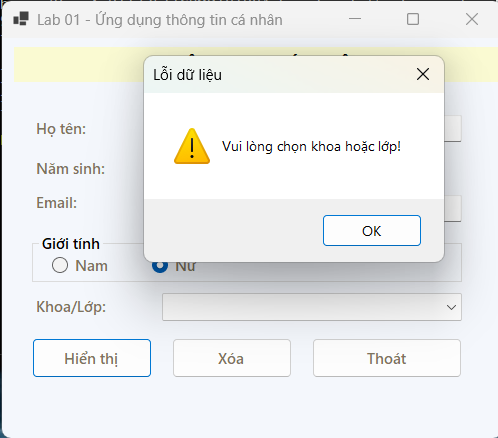
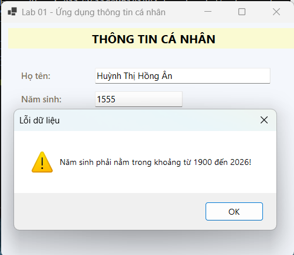
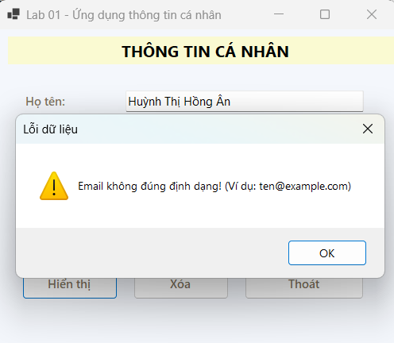
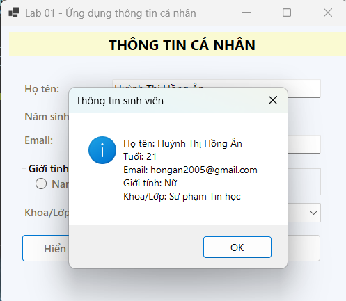
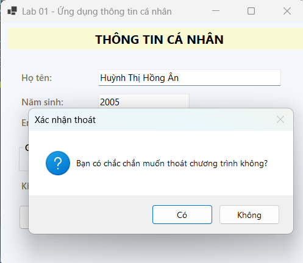

# Lab 01 - Ứng dụng thông tin cá nhân

## Mô tả
Ứng dụng WinForms cho phép nhập và hiển thị thông tin cá nhân gồm: họ tên, năm sinh, giới tính, khoa và email.

## Chức năng
- Nhập họ tên, năm sinh, email.
- Chọn giới tính (Nam/Nữ).
- Chọn khoa từ danh sách có sẵn.
- Hiển thị thông tin đã nhập.
- Xóa dữ liệu trên form.
- Thoát chương trình.

## Công nghệ sử dụng
- C# WinForms
- .NET 8

## Cách chạy
1. Mở file `Lab01_UNGDUNGTHONGTINCANHAN/Lab01_Ungdungthongtincanhan.sln` bằng Visual Studio.
2. Build solution.
3. Nhấn F5 để chạy chương trình.

## Hình ảnh minh họa

### Màn hình chính

### Cảnh báo khi bỏ trống thông tin

### Cảnh báo khi chưa chọn giới tính

### Cảnh báo khi chưa chọn khoa

### Cảnh báo khi năm sinh không hợp lệ

### Cảnh báo khi email sai định dạng

### Hiển thị kết quả

### Xác nhận thoát chương trình
