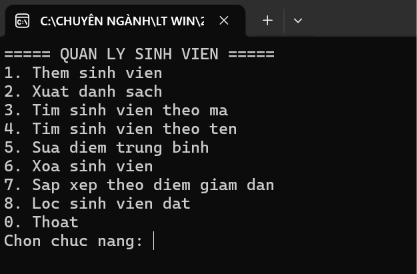
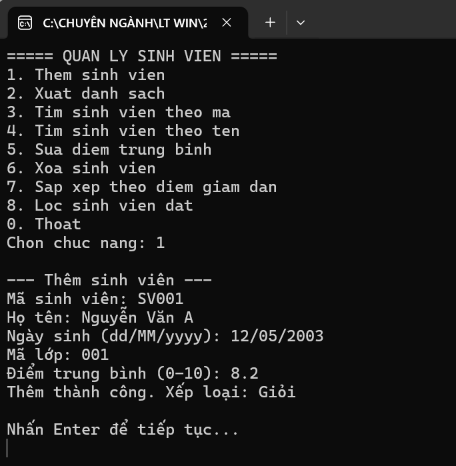
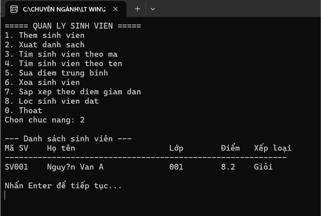
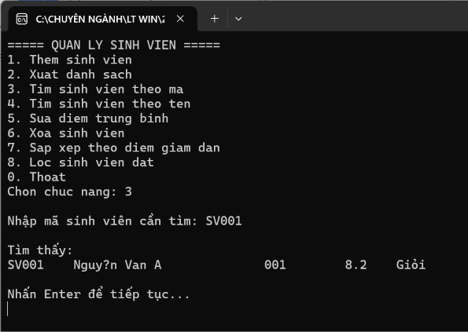
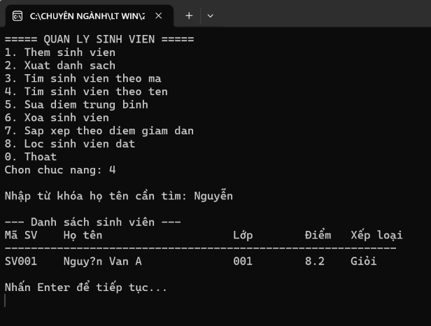
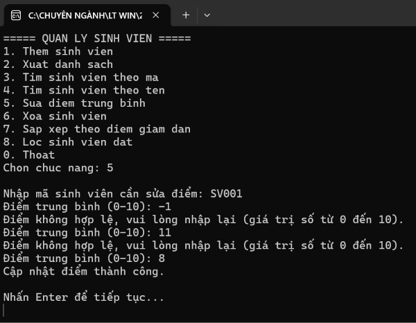
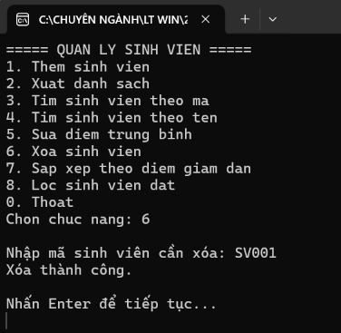
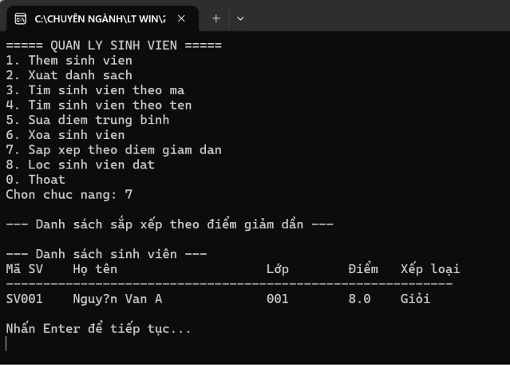
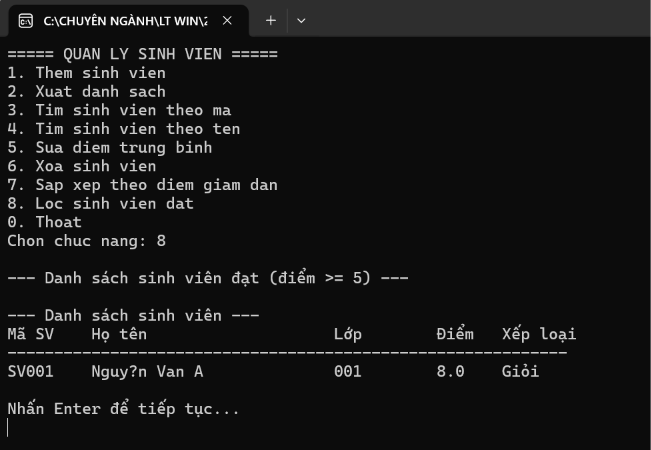
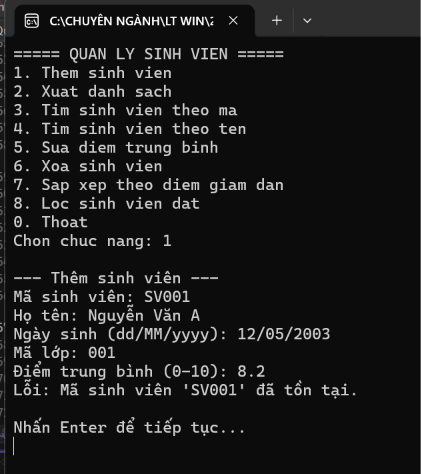

# Lab 03 - Quản lý sinh viên bằng Console (C# OOP)

## Thông tin sinh viên
- Họ tên: Huỳnh Thị Hồng Ân
- MSSV: 49.01.103.006
- Lớp: 49.01.SPTIN.A

## Mô tả
Chương trình Console C# quản lý danh sách sinh viên theo hướng đối tượng. Dữ liệu được lưu trong bộ nhớ bằng `List<SinhVien>`. Chương trình hiển thị menu để người dùng lựa chọn chức năng, thực hiện xong sẽ quay lại menu cho đến khi người dùng chọn thoát.

## Công nghệ sử dụng
- C# Console App
- .NET (Visual Studio)
- Lập trình hướng đối tượng: kế thừa, override, property có kiểm tra dữ liệu
- LINQ (tìm kiếm, lọc, sắp xếp)

## Yêu cầu class
- `Nguoi`: là lớp cha, có `HoTen`, `NgaySinh` và constructor, method `LayThongTin()` có thể override.
- `SinhVien`: kế thừa từ `Nguoi`, thêm `MaSinhVien`, `MaLop`, `DiemTrungBinh` (property kiểm tra chỉ nhận giá trị 0-10) và `XepLoai()`.
- `QuanLySinhVien`: quản lý `List<SinhVien>`, gồm Thêm, Sửa, Xóa, TimTheoMa, TimTheoTen, SapXepTheoDiem, LayDanhSach.
- `Program`: chứa Main, menu và các hàm nhập dữ liệu, gọi service xử lý.

## Chức năng
- Thêm sinh viên (nhập mã, họ tên, ngày sinh, mã lớp, điểm trung bình; mã sinh viên không được trùng)
- Xuất danh sách sinh viên (mã, họ tên, lớp, điểm, xếp loại)
- Tìm sinh viên theo mã
- Tìm sinh viên theo tên (chứa từ khóa)
- Sửa điểm trung bình theo mã sinh viên
- Xóa sinh viên theo mã
- Sắp xếp danh sách theo điểm giảm dần (dùng LINQ)
- Lọc sinh viên đạt (điểm trung bình từ 5 trở lên) (dùng LINQ)
- Thoát chương trình

## Cách chạy
1. Mở file `.sln`/`.csproj` bằng Visual Studio
2. Build solution
3. Chạy project (F5 hoặc Ctrl+F5)
4. Chọn chức năng theo menu hiển thị trên màn hình Console

## Xử lý dữ liệu nhập
- Nhập sai kiểu dữ liệu (ví dụ chữ vào ô điểm hoặc ngày sinh) không làm chương trình dừng bất thường; chương trình sẽ báo lỗi và yêu cầu nhập lại.
- Điểm trung bình chỉ nhận giá trị từ 0 đến 10; nếu nhập ngoài khoảng này, chương trình báo không hợp lệ và yêu cầu nhập lại.
- Thêm sinh viên với mã đã tồn tại sẽ bị từ chối và báo lỗi mã đã tồn tại.
- Sửa hoặc xóa sinh viên với mã không tồn tại sẽ được thông báo không tìm thấy.

## Hình ảnh màn hình

### Menu chương trình

### Thêm sinh viên

### Xuất danh sách

### Tìm theo mã

### Tìm theo tên

### Sửa điểm trung bình

### Xóa sinh viên

### Sắp xếp theo điểm giảm dần

### Lọc sinh viên đạt

### Xử lý nhập sai (mã trùng, điểm ngoài khoảng 0-10, mã không tồn tại)
