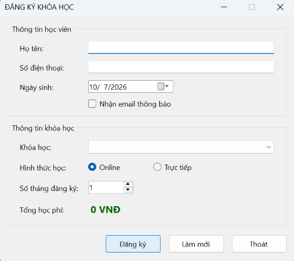
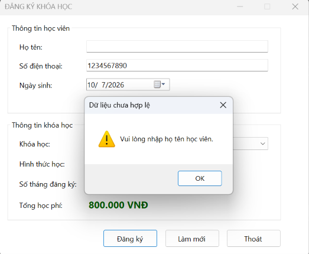
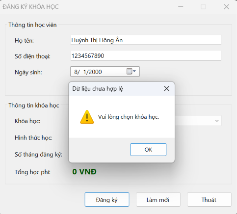
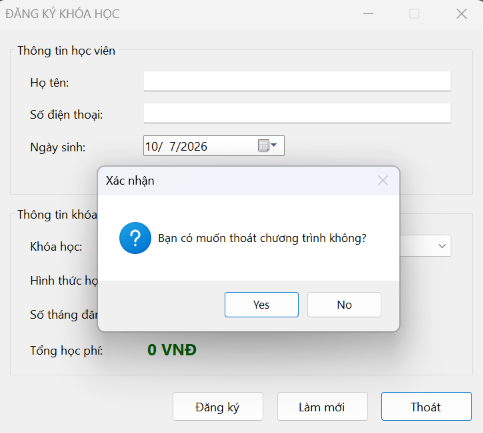

# Lab 05 - Windows Forms cơ bản: Ứng dụng đăng ký khóa học

## Thông tin sinh viên
- Họ tên: Huỳnh Thị Hồng Ân
- MSSV: 49.01.103.006
- Lớp: 49.01.SPTIN.A
- Học phần: COMP1019 - Lập trình trên Windows

## Mô tả
Ứng dụng WinForms (C#, .NET 8) dùng để đăng ký khóa học. Người dùng nhập thông tin học viên, chọn khóa học, hình thức học và số tháng; tổng học phí được tính tự động và phiếu đăng ký hiển thị bằng MessageBox. Dữ liệu chỉ xử lý trên Form, không lưu cơ sở dữ liệu.

## Cấu trúc project
| File | Nội dung |
|---|---|
| `Lab05/Program.cs` | Điểm khởi chạy ứng dụng |
| `Lab05/KhoaHocInfo.cs` | Record lưu tên khóa học và học phí mỗi tháng |
| `Lab05/FrmDangKyKhoaHoc.cs` | Xử lý sự kiện và logic |
| `Lab05/FrmDangKyKhoaHoc.Designer.cs` | Giao diện Form |

## Danh sách control
| Nhóm | Control | Tên control | Ghi chú |
|---|---|---|---|
| Thông tin học viên (`grpHocVien`) | TextBox | `txtHoTen` | Nhập họ tên |
| | TextBox | `txtSoDienThoai` | Nhập số điện thoại |
| | DateTimePicker | `dtpNgaySinh` | Chọn ngày sinh |
| | CheckBox | `chkNhanEmail` | Nhận email thông báo |
| Thông tin khóa học (`grpKhoaHoc`) | ComboBox | `cboKhoaHoc` | Chọn khóa học |
| | RadioButton | `radOnline` | Hình thức online |
| | RadioButton | `radOffline` | Hình thức trực tiếp |
| | NumericUpDown | `numSoThang` | Số tháng (1 - 12) |
| | Label | `lblTongTien` | Tổng học phí |
| Nút lệnh | Button | `btnDangKy` | Đăng ký |
| | Button | `btnLamMoi` | Làm mới |
| | Button | `btnThoat` | Thoát |

## Dữ liệu khóa học
| Khóa học | Học phí/tháng |
|---|---|
| C# WinForms cơ bản | 800.000 VNĐ |
| SQL Server cơ bản | 700.000 VNĐ |
| Web Frontend cơ bản | 750.000 VNĐ |
| Lập trình Python cơ bản | 650.000 VNĐ |

Công thức: Tổng học phí = Học phí một tháng × Số tháng.

## Chức năng
- Form Load: nạp khóa học, để trống ô khóa học (chưa chọn khóa nào), chọn mặc định hình thức Online, số tháng từ 1 đến 12, hiển thị học phí ban đầu.
- Tự tính lại học phí khi đổi khóa học hoặc số tháng.
- Đăng ký: kiểm tra họ tên, số điện thoại, khóa học rồi hiển thị phiếu đăng ký.
- Làm mới: đưa toàn bộ dữ liệu về mặc định (bỏ chọn khóa học), con trỏ về ô họ tên.
- Thoát: hỏi xác nhận, chọn Yes mới đóng Form.

## Cách chạy
1. Mở `Lab05.sln` bằng Visual Studio 2022.
2. Build solution rồi nhấn F5.

## Hình ảnh minh họa

### Màn hình chính (khi Form Load)

### Tổng học phí thay đổi khi chọn khóa học hoặc số tháng

### Cảnh báo khi chưa nhập họ tên

### Cảnh báo khi chưa nhập số điện thoại

### Cảnh báo khi chưa chọn khóa học

### Hiển thị phiếu đăng ký

### Làm mới dữ liệu

### Xác nhận thoát chương trình

